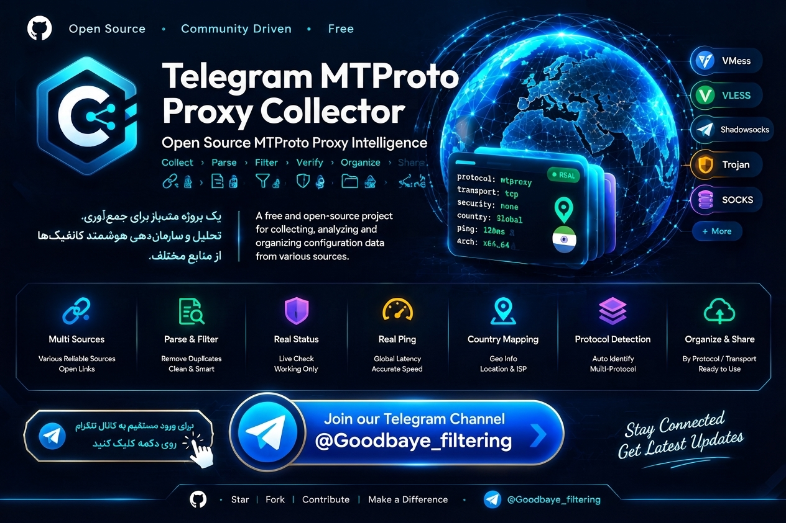

  

<h1 align="center">🚀 Telegram MTProto Proxy Collector v3.0</h1>

  <b>سیستم خودکار جمع‌آوری، سنجش پینگ واقعی، فیلتر هوشمند و انتشار پروکسی‌های تلگرام</b>

  
  
  

---

## 🌟 ویژگی‌های نسخه جدید (v3.0)

* 🛡️ **امنیت کامل سورس‌ها:** دریافت لینک‌ها از بخش محرمانه (`GitHub Secrets`) بدون نمایش منابع در کد عمومی.
* ⏱️ **اجرای خودکار هوشمند:** زمان‌بندی دقیق در دقیقه ۵ هر ۳ ساعت (`5 */3 * * *`) برای فرار از پیک ترافیک گیت‌هاب.
* 🧪 **تست اتصال واقعی (TCP Ping):** اندازه‌گیری دقیق پینگ و تأخیر پاسخ‌دهی سرورها به میلی‌ثانیه و حذف خودکار پروکسی‌های قطعی.
* 🖼️ **پست چندرسانه‌ای جذاب:** انتخاب و ارسال خودکار تصویر باکیفیت به همراه جملات انگیزشی، اشعار پارسی و دانستنی‌های علمی روز.
* 🔗 **چیدمان هایپرلینک مستقیم:** نمایش سریع‌ترین پروکسی‌ها به صورت متن‌های آبی هایپرلینک (`پروکسی | پروکسی`) برای باز شدن فوری پنجره اتصال تنها با یک لمس.
* 📌 **سنجاق خودکار (Auto-Pin):** پین شدن سریع‌ترین پست در بالای کانال بلافاصله پس از انتشار.
* 📦 **ارسال فایل کامل سابسکرایب:** ذخیره و ارسال فایل متنی تمام پروکسی‌های تست‌شده در انتهای هر فرآیند.

---

## ⚙️ متغیرهای محیطی مورد نیاز (GitHub Secrets)

برای اجرای پروژه باید مقادیر زیر در بخش **Repository Secrets** تعریف شوند:

| نام متغیر | توضیحات |
| :--- | :--- |
| `BOT_TOKEN` | توکن ربات تلگرام دریافت‌شده از BotFather |
| `CHAT_ID` | شناسه عددی چت یا آیدی کانال هدف |
| `PROXY_SOURCES` | لیست آدرس سورس‌های استخراج پروکسی (خط به خط) |

---

## 📡 عضویت در کانال

جدیدترین پروکسی‌های پرسرعت و پایدار به‌صورت خودکار در کانال زیر منتشر می‌شوند:

  

---

  ⭐️ <i>اگر این پروژه برایتان کاربردی بود، خوشحال می‌شویم به مخزن ستاره (Star) بدهید!</i>

